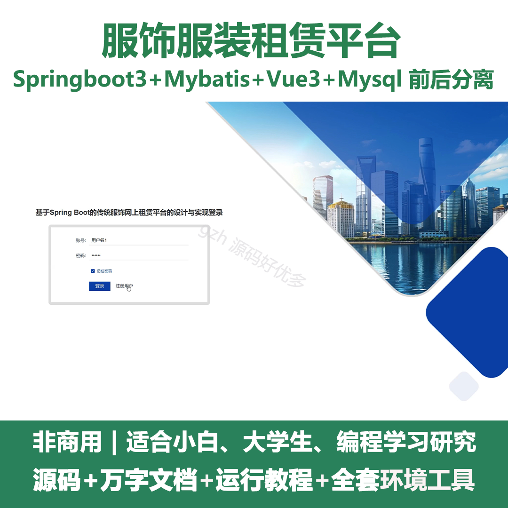
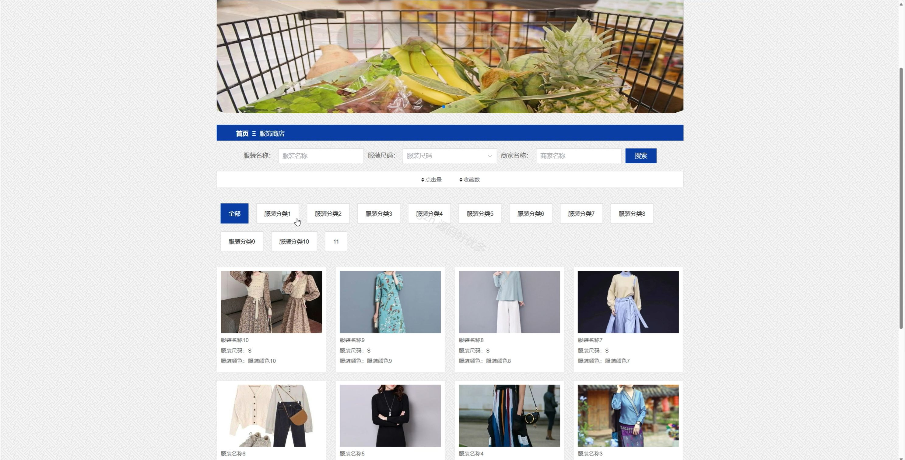
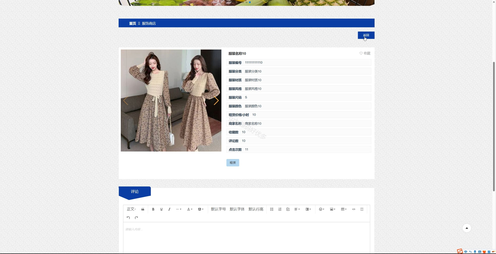
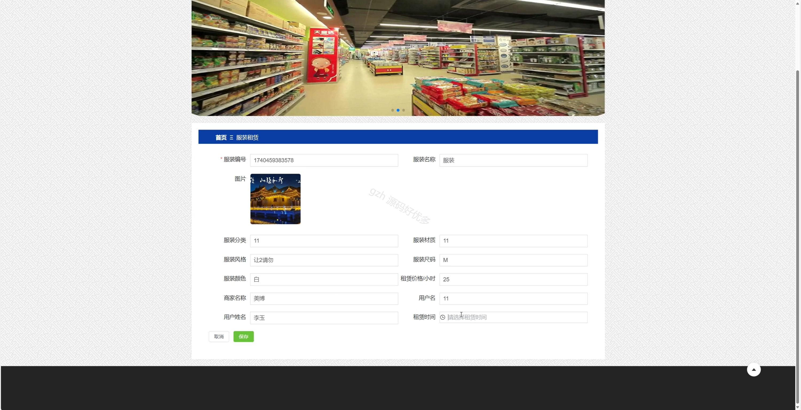
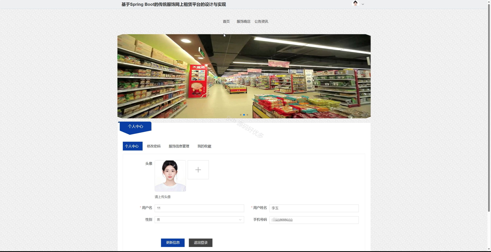
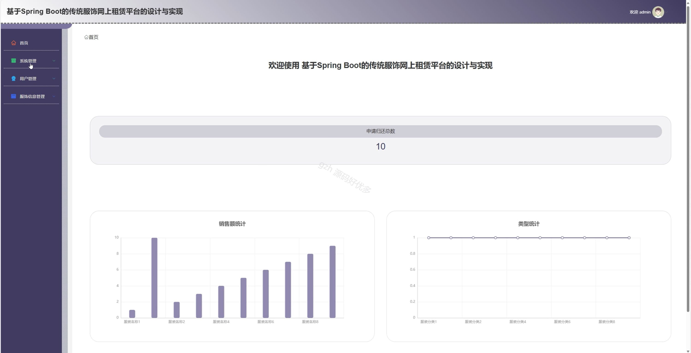
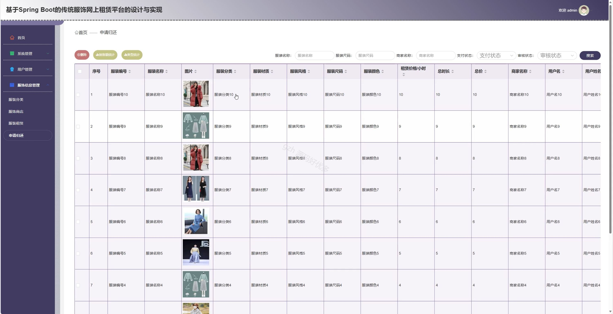
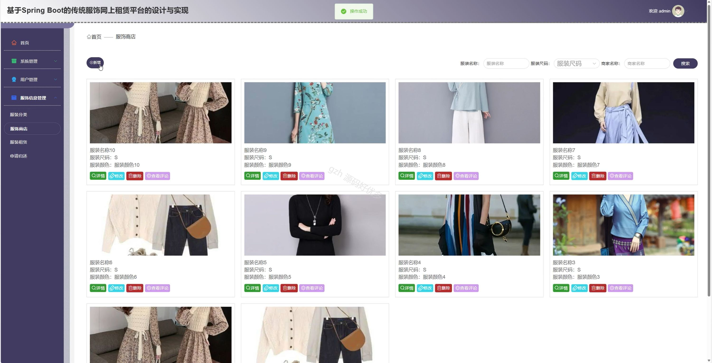
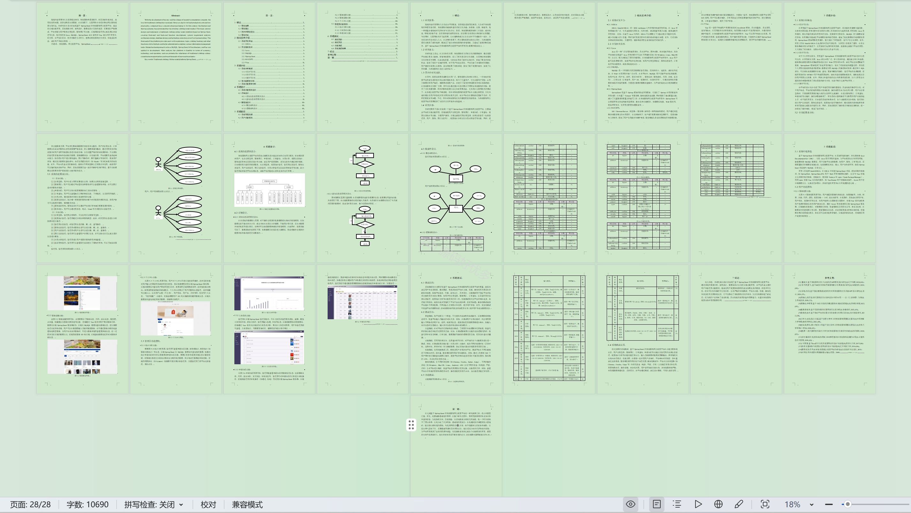

# springbootA524D
springbootA524D服饰服装租赁平台+LW
 
## 查看主页获取源码

### 一、关键词
服装租赁、服饰商店、服饰信息管理

### 二、作品包含
源码+数据库+设计文档万字+全套环境和工具资源+部署教程

### 三、项目技术
前端技术：Html、Css、Js、Vue3.0、Element-plus
后端技术：Java、SpringBoot3.0、MyBatis

### 四、运行环境（以下版本亲测，其他版本未知，请自测）
开发工具：IDEA/eclipse  + VSCODE

数据库：MySQL5.7（最低要5.7版本）

数据库管理工具：Navicat10以上版本

环境配置软件： JDK17 + Maven3.6.3

前端Nodejs：20

浏览器：谷歌浏览器

### 五、项目介绍
项目编号：springbootA524D

服饰服装租赁平台可提供服装租赁相关服务，涵盖服饰信息管理等功能，方便用户租还服装。

角色：管理员、用户

管理员：首页、系统管理、用户管理、服装分类、服饰商店、服装租赁、申请归还。

用户：首页、服饰商店、公告资讯、个人中心、修改密码、服饰信息管理、我的收藏。

### 六、运行截图

